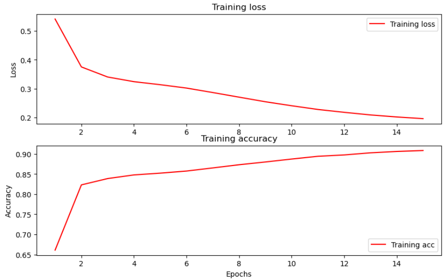

# Sentiment Analysis Project

For a complete description about the project visit --> [here!](https://haarrublar.com/blog/2024/4/26/tensorflow-lstm-text-classification-with-emoji-mask/).

This tiny project emerged from the need of the company I am working for to analyze big dataset information regarding customer experiences and comments during several processes, from initial contact to post-sale. Despite deciding to use statistical classification analysis using Naive-Bayes with hyper-parameter tuning, I also chose to implement a simple bidirectional LSTM (Long Short-Term Memory) classification model using [TensorFlow's](https://www.tensorflow.org/) sequential models.

I am not presenting the company's dataset due to privacy policies, but I am sharing the basic training algorithm used in the initial stage for this purpose. I must say that I prefer using the Naive-Bayes algorithm over this, but it was a really good practice using TensorFlow and sequential models. Due to the fact, it is quite more friendly using a framework different than jupyter notebooks, I tried to add [streamlit](https://docs.streamlit.io/) into the final project, and I present an small streamlit app highly customizable for different purposes.

I sincerely must admit that prefer Django, but for simplicity streamlit is a quite decent framework.


## Table of Contents
- [Distribution Information](#distribution-information)
- [Setup](#setup)
- [Performance](#performance)
- [License](#license)
- [Contact](#contact)


## Distribution Information

The model is distributed by pre_saved models that you can play with. Additionally, the dataset used for the model training is present.

```
├── app
│   ├── models
│   │   ├── 2T
│   │   │   └── model2T_15e
│   │   │       ├── assets
│   │   │       └── variables
│   │   ├── 4T
│   │   │   └── model4T
│   │   │       ├── assets
│   │   │       └── variables
│   │   └── 8T
│   │       └── model8T
│   │           ├── assets
│   │           └── variables
└── model
    └── media
        ├── datasets
        │   ├── csv
        │   └── MMcomments
        ├── models
        │   ├── 2T
        │   │   └── model2T_15e
        │   │       ├── assets
        │   │       └── variables
        │   ├── 4T
        │   │   └── model4T
        │   │       ├── assets
        │   │       └── variables
        │   └── 8T
        │       └── model8T
        │           ├── assets
        │           └── variables
        └── vocabulary
```

## Setup

To set up the project, follow these steps:

1. **Clone the Repository:** Clone the project repository from GitHub.
   ```sh
   git clone https://github.com/haarrublar/XAnalizer
   ```

2. **Activate the Conda Environment:** Navigate to the project directory and activate the Conda environment.

   ```sh
   cd your_project
   conda create --name <env> --file condaRequirements.txt
   conda activate <env>
   ```

With the project initialized, you have two alternatives: Jupyter notebooks or a Streamlit app. Here's how you can proceed with each:

**Jupyter Notebooks:**
1. Navigate to the notebooks directory in the XAnalizer project.
3. Open and run the desired notebook for data analysis or model training.

**Streamlit App:**
1. Run the Streamlit app from the project directory.
   ```sh
   streamlit run app.py
   ```
3. Access the app in your web browser at the provided address (usually `http://localhost:8501`).


## Performance

The simple sequence classification model has a decent performance. It is intended to be better structured and trained. Nevertheless, the accuracy it offers is a quite good starting point for learning purposes.





As result we have a model evaluation using the test dataset with Loss: 0.12 and Accuracy: 0.95.

## License

This project is licensed under the [MIT License](LICENSE).

## Contact

If you have any questions or feedback, feel free to reach out:

- Email: [harrubla.96@gmail.com](mailto:harrubla.96@gmail.com)
- Twitter: [@haarrublar](https://x.com/haarrublar)

